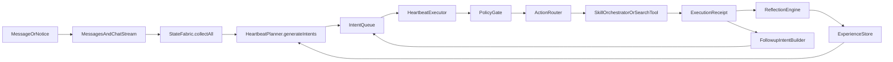

# heartbeat_v2 阶段进展与后续开发选项

这份文档用于记录 `heartbeat_v2` 这条开发主线目前已经形成的方向、已完成内容、当前暂停点，以及尚未真正开展的方向。

目的不是复述全部历史，而是为了之后继续开发时，可以快速做选择。

## 当前总方向

`heartbeat_v2` 当前已经明确的主线是：

1. 把 AI 从“收到消息就回复”升级为“持续收集状态 -> 主动规划 -> 执行动作 -> 结果回流 -> 经验蒸馏”的系统。
2. 把 `reply / memory / tool / search / skill / followup` 统一进一条可观察、可学习的 action 闭环。
3. 尽量先做外部记忆、策略学习、目标选择和执行编排，不急着上重型总规划模型。

## 已完成内容



下面这些方向已经落到了代码里，不再是概念阶段。

### 1. heartbeat_v2 主循环骨架

已形成：

- `state_fabric -> planner -> intent_queue -> executor -> router -> receipt -> reflection -> history`
- `fast / normal / slow` 三档循环

主要落点：

- `src/chat/heartbeat_v2/system.py`
- `src/chat/heartbeat_v2/planner.py`
- `src/chat/heartbeat_v2/executor.py`
- `src/chat/heartbeat_v2/router.py`

### 2. 统一状态平面与核心数据结构

已形成：

- `Observation`
- `Intent`
- `Plan`
- `ExecutionReceipt`
- `ReflectionRecord`
- `PlanGraph / PlanExecutionState` 轻量骨架

主要落点：

- `src/chat/heartbeat_v2/models.py`
- `src/chat/heartbeat_v2/state_fabric.py`

### 3. 记忆三层与经验蒸馏

已形成：

- 事件记忆、事实记忆、策略记忆快照
- 反思记录写入
- 策略蒸馏、命中计数、成功率、时间衰减、planner 权重

主要落点：

- `src/chat/heartbeat_v2/reflection.py`
- `src/chat/heartbeat_v2/experience_store.py`
- `src/dream/dream_agent.py`

### 4. skill 编排与 skill 级策略学习

已形成：

- `tool_call` 不再只是直接调工具
- 已有 `memory_recall_skill / tool_use_skill / web_search_skill`
- 已支持 `skill_combo` 学习、探索率、失败惩罚、淘汰和 `selection_mode` 学习

主要落点：

- `src/chat/heartbeat_v2/skill_orchestrator.py`
- `src/chat/heartbeat_v2/experience_store.py`

### 5. 主动搜索最小闭环

已形成：

- `explore` 意图
- `search_web` action
- `web_search_skill` 调用搜索插件
- receipt 回流为 followup reply

主要落点：

- `src/chat/heartbeat_v2/planner.py`
- `src/chat/heartbeat_v2/router.py`
- `src/chat/heartbeat_v2/system.py`
- `plugins/XXXxx7258.google_search_plugin/plugin.py`

### 6. share_decider 升级为目标聊天流选择器

已形成：

- `TargetChatCandidate` 候选聚合
- `TargetChatSelector` 目标聊天流选择
- 支持 `ChatStreams + Messages + PersonInfo + runtime stream`
- 支持人名/群名/别名匹配、关系记忆权重、聊天频率、冷却策略
- 为未来关系系统预留 `set_relation_weight_provider()` hook

主要落点：

- `src/chat/heartbeat_v2/target_selector.py`
- `src/chat/heartbeat_v2/state_fabric.py`
- `src/chat/heartbeat_v2/planner.py`

### 7. 主动目标源第一版

已形成：

- 把未解决问题、近期事件、关系记忆、失败动作统一为 `ActiveGoalCandidate`
- `planner` 会优先从主动目标源挑选 explore 目标

主要落点：

- `src/chat/heartbeat_v2/active_goal_source.py`
- `src/chat/heartbeat_v2/state_fabric.py`
- `src/chat/heartbeat_v2/planner.py`

### 8. Prompt 风格开始进入主动搜索链

已形成：

- 搜索插件中的查询重写、网页总结、搜索总结 prompt 改为 `Prompt(...)` 注册模板
- `heartbeat_v2` 内部增加统一结构化解析工具，减少散落的 JSON 解析写法

主要落点：

- `plugins/XXXxx7258.google_search_plugin/plugin.py`
- `src/chat/heartbeat_v2/structured_output.py`
- `src/chat/heartbeat_v2/state_fabric.py`
- `src/chat/heartbeat_v2/target_selector.py`

## 当前暂停点

当前明确暂停的是：

- 继续深挖 `TargetChatSelector` 的规则细节
- 继续做 selector 与未来关系系统的真正联动
- 继续扩展 `reply_generator_adapter` 与旧回复主链的深度桥接

暂停原因不是方向错误，而是当前更需要：

1. 把开发方向记录清楚
2. 把 `Prompt + 结构化解析` 这套写法统一进后续会继续扩展的链路
3. 先补上 planner 侧真正的“模型调用输入模板 + 结构化输出约束”，避免只把生命周期对象定义完整，但生产阶段仍然是松散规则拼装

## 已决定但还没真正展开的方向

这些方向已经判断为“值得做”，但还没有真正展开成完整工程阶段。

### A. heartbeat_v2 与旧回复主链桥接

当前状态已更新：

- 已经做了最小桥接：
  - `reply_generator_adapter`
  - `planner -> executor -> router -> adapter -> old replyer`
- 但这条线先暂停，不继续深挖。

后续价值：

- 让 heartbeat_v2 真正接入更成熟的回复生成链
- 避免主动规划层和最终回复质量脱节

当前暂停原因：

- 当前更关键的问题不是“reply 能不能更像原来”
- 而是 `planner.generate_intents()` 还没有经过统一 prompt 输入与结构化输出约束
- 如果 planner 的 intent 参数构造仍然主要靠手写规则，后面继续扩 reply 桥接，会把“生成质量”接上，但“规划质量”仍然悬空

### B. LLM planner

当前 planner 仍以规则和策略提示为主。

后续价值：

- 让规划能基于更丰富的状态 summary 进行更高层决策
- 但前提是 state summary 和结构化输出先稳住

### C. 分场景策略学习

当前已经有策略学习，但粒度还不够细。

后续价值：

- 按 `group / private / notice / multimodal / active_search` 等场景拆策略
- 提高 planner 与 skill 组合的针对性

### D. 更成熟的行为风险门控

当前已有 `cost / risk / interruptiveness` 等字段，但仍偏轻量。

后续价值：

- 让主动行为更可控
- 避免主动搜索、主动分享、跨聊天流发送过度打扰

## 还没有真正进行过的方向

下面这些方向还没有真正进入实施阶段，之后可作为开发选择项。

### 1. 关系系统正式接入 selector

当前状态：

- 只做了 hook
- 还没有真正把“关系系统模块”的动态权重接进来

建议前置条件：

- 关系系统先形成稳定接口
- 明确输出的是 `chat-user` 级权重还是 `person` 级权重

### 2. Prompt 化的 heartbeat_v2 planner / share_decider

当前状态：

- `heartbeat_v2` 里真正直接调模型的点还不多
- 目前更多是规则式 planner

建议方向：

- 先从 `planner_prompt.py` 开始：
  - 定义统一 prompt 输入模板
  - 明确结构化 JSON 输出 schema
  - 再决定最小接线点是 `LLM 辅助 planner` 还是 `LLM intent generator`
- 之后再把主动规划中最适合结构化输出的部分改成 `Prompt + JSON 解析`
- 例如：意图生成、主动目标评估、share 理由生成、plan step 生成

## 本轮新增确认：Intent 生命周期与 planner prompt

### 1. Intent 是否已经有“完整生命周期”

当前结论：

- 数据结构层面，已经接近完整：
  - `Observation`
  - `Intent`
  - `Plan`
  - `ExecutionReceipt`
  - `ReflectionRecord`
  - `HeartbeatHistoryItem`
- 但从“真实生产链路”看，还不算完整。

原因：

- 现在 `Intent -> Plan -> Receipt` 这条对象链是完整的
- 但 `Intent` 的“生产阶段”仍然主要由 `planner.py` 中的手写规则直接构造
- 这意味着：
  - 生命周期在“执行和记录”阶段是完整的
  - 但在“生成与约束”阶段仍然缺少统一 schema、统一 prompt 输入和统一模型输出约束

因此更准确的判断是：

- `Intent` 目前拥有“执行生命周期”
- 但还没有真正拥有“受约束的规划生命周期”

### 2. 当前生产 intent 时，参数是如何构建的

当前实现方式：

1. `StateFabric.collect_all()` 汇总 `observation / memory / history / chat / capability / goal`
2. `HeartbeatPlanner.generate_intents()` 读取这些状态
3. 在规则分支中直接构造：
   - `intent_type`
   - `target_chat_id`
   - `payload`
   - `priority / urgency / confidence / cost_hint / risk_hint / interruptiveness`
4. 之后 `HeartbeatExecutor.intent_to_plan()` 再把 intent 进一步映射成 plan
5. `ActionRouter` 执行动作，生成 `ExecutionReceipt`

当前问题：

- 构造字段的来源是“分散在代码里的局部规则”
- 这些字段没有经过统一输出 schema 约束
- 很多参数虽然在对象层面存在，但语义上仍然偏手工拼装

### 3. 下一阶段要先做什么

本轮新的优先级调整为：

1. 先做 `heartbeat_v2/planner_prompt.py`
2. 明确定义统一 prompt 输入模板
3. 明确结构化 JSON 输出 schema
4. 再考虑把它接入 `planner.generate_intents()` 或抽象后的 generator 框架

这样做的目的不是立刻把 planner 全量 LLM 化，而是先把“规划输入/输出协议”稳定下来。

### 3. 真正的多步 plan executor

当前状态：

- 只有 `PlanGraph / PlanExecutionState / execute_plan_graph()` 骨架
- 还没有真正接到具体意图上持续运行

还缺：

- 节点级恢复
- 中间结果持久化
- plan 级反思
- 失败重规划

### 4. 主动目标源第二版

当前状态：

- 已有第一版聚合
- 但还没有真正引入“周期主题、用户长期兴趣、未完结话题状态机”

下一阶段可以做：

- topic backlog
- user interest profile
- pending followup queue

### 5. 主动行为的“发给谁/为什么发”解释层

当前状态：

- selector 已能输出 `selector_reason`
- 但还没有把它发展为可读性更强的 explain layer

后续价值：

- 便于调试
- 便于日志和 UI 观察

## 当前建议的开发选择顺序

如果继续沿这条线开发，建议优先级如下：

1. 继续统一 `Prompt + 结构化解析` 在主动搜索和规划相关模块中的用法
2. 做 heartbeat_v2 与旧回复主链桥接
3. 再决定是走 `LLM planner`，还是先补 `主动目标源第二版`
4. 最后再把 `PlanGraph` 真正升级为可恢复的多步执行系统

## 本轮确认事项

下面这些是本轮围绕 `heartbeat_v2` 运行方式进一步确认下来的结论，后续开发默认以这些判断为基础。

### 1. `system` 的收集是否要往消息队列方向靠

当前实现：

- `heartbeat_v2` 不是直接消费“原始消息队列”。
- 外部输入先进入消息系统，落到 `Messages` 表和运行时 `ChatStream`。
- `StateFabric.collect_all()` 再在 tick 时统一读取 `Messages / ChatStream / ChatHistory / ThinkingBack / PersonInfo / HistoryStore`，构造成 `state`。

判断：

- 现在这条“先持久化，再由心跳读取”的方式是对的，适合当前架构。
- 但后续可以增加“事件总线 / observation queue”作为增量输入层，让 heartbeat 能更细粒度地感知新事件，而不是只按时间窗口扫库。

建议：

- 短期不要把 `heartbeat_v2` 直接改成消费原始消息队列。
- 中期可以增加 `observation_event_queue`，作为 `Messages` 之上的轻量事件输入层。

### 2. `system` 循环增加重启机制，以及停止时记录“睡了多久”

当前实现：

- `HeartbeatV2System.start()` / `stop()` 只负责启动和停止三条协程。
- 目前没有显式记录“上次停止时间 / 本次启动时间 / 中间休眠了多久”。
- 也没有心跳级自恢复机制，异常主要靠循环内部 `try/except` 顶住。

判断：

- 这是值得做的，而且比较贴合 heartbeat 的“有趣人格感”。

建议：

- 记录：
  - `last_started_at`
  - `last_stopped_at`
  - `sleep_duration_s`
- 停止时输出日志，启动时也输出“这次睡了多久”。
- 后续可进一步做：
  - 子协程退出后的自动重启
  - 连续异常熔断

### 3. `planner.generate_intents()` 需要抽象成注册式框架

当前实现：

- 当前 `planner.py` 里的意图生成是直接在 `generate_intents()` 里堆规则分支：
  - `reply`
  - `retrieve`
  - `tool_call`
  - `explore`
  - `no_op`

判断：

- 这已经能跑，但扩展性会越来越差。
- 下一阶段应把“意图生成器”抽象成可注册的 provider / rule / generator 机制。

建议框架：

- 每类意图由独立 generator 负责，例如：
  - `ReplyIntentGenerator`
  - `MemoryRetrieveIntentGenerator`
  - `ToolCallIntentGenerator`
  - `ExploreIntentGenerator`
- planner 只做：
  - 汇总上下文
  - 依次调用注册的 generators
  - 统一排序

这样后面接 LLM planner 时也更自然，可以把 “规则 generator” 和 “LLM generator” 并存。

### 4. 三个心跳协程是怎么消费意图的

当前实现：

- `fast_loop`
  - 不消费意图
  - 负责 `requeue_delayed()`、`drop_expired()`
- `normal_loop`
  - 唯一真正消费意图的协程
  - 执行：
    - `collect_all`
    - `generate_intents`
    - `enqueue`
    - `dequeue`
    - `execute`
    - `reflection`
    - `followup enqueue`
- `slow_loop`
  - 不消费意图
  - 负责日志观测和反思蒸馏

结论：

- 当前系统里，真正消费意图的是 `normal_loop`。
- `fast` 和 `slow` 是辅助循环，不负责执行动作。

### 5. 心跳协程的睡眠时间受策略影响

当前实现：

- 三条循环的睡眠时间目前来自静态配置：
  - `fast_interval`
  - `normal_interval`
  - `slow_interval`

判断：

- 后续确实应该让睡眠时间受策略影响。

建议方向：

- 先做轻量动态调节，而不是复杂调度器。
- 可参考信号：
  - 队列长度
  - 最近 observation 密度
  - 最近 notice 数量
  - 当前是否有 active goal
  - 当前 mood / 打扰性策略

可演进为：

- 安静时拉长 `normal_loop`
- 有高 salience 输入时缩短 `normal_loop`
- 有大量 delayed intents 时加快 `fast_loop`

### 6. `TargetChatSelector` 的工作流程，以及它与“把可选对象元信息喂给规划器 prompt”之间的差别

当前 `TargetChatSelector` 工作流程：

1. `TargetChatCandidateBuilder` 从这些来源聚合候选聊天流：
   - `ChatStreams`
   - `Messages`
   - `PersonInfo`
   - runtime `ChatStream`
2. 构造成 `TargetChatCandidate`
3. `TargetChatSelector` 对候选项打分：
   - 源 chat 优先
   - 人名/群名/别名匹配
   - 最近消息内容重叠
   - 关系记忆权重
   - 聊天频率
   - 搜索冷却惩罚
4. 输出：
   - `share_target_chat_id`
   - `selector_reason`
   - `selector_score`
   - `selector_candidates_preview`

它和“提供可选对象元信息到规划器提示词中”的差别在于：

- 当前 selector 是规则式、确定性的前置模块
- “把候选对象元信息喂给规划器 prompt” 属于 LLM 决策式后置模块

两者对比：

- 当前规则 selector
  - 优点：稳定、快、可解释、便于调试
  - 缺点：语义泛化能力有限
- 未来 LLM selector
  - 优点：能利用更复杂语义和上下文
  - 缺点：成本更高、速度更慢、稳定性更依赖 prompt 和解析

建议：

- 当前继续保留规则 selector 作为 baseline
- 未来可以做“LLM 辅助 selector”
  - 输入：候选对象元信息 + 当前 state summary
  - 输出：结构化 target 选择结果
- 不建议直接删掉规则 selector，而应作为 fallback

### 7. `PromptBuilder` 接入 heartbeat_v2 的方向确认

已确认的目标是：

- 在 `heartbeat_v2` 中，不只用 `Prompt` 存模板，还要让它成为：
  - 结构化输入上下文构造器
  - 结构化输出约束入口
  - 统一可读性层

LLM planner 的最小输入建议至少包括：

- 当前元信息
- 心跳历史摘要
- 输入源
- 输入内容
- 可选能力列表
- 候选聊天流元信息
- 主动目标候选

结构化输出建议至少包括：

- `intents`
- 每个 intent 的：
  - `intent_type`
  - `target_chat_id`
  - `payload`
  - `priority`
  - `urgency`
  - `confidence`
  - `cost_hint`
  - `risk_hint`
  - `interruptiveness`

结论：

- 这条方向是正确的。
- 但建议先做成 “LLM 辅助 planner / 辅助 selector”，不要一步把整个 planner 全量 LLM 化。

## 本轮追加设计思路

下面这些是本轮新增的设计讨论，属于“后续架构约束与演进建议”，暂不代表都已实现。

### 1. 多模态模型 API 扩展性

问题：

- 如果后续接入多模态模型 API，支持同时上传 `content / imageURLs / fileUrls`，当前 heartbeat 架构能否扩展。

现状判断：

- 当前 `Observation` 已经有 `source / text / metadata`，并且 `StateFabric` 已经把文本、图片、语音、notice 统一映射为 observation。
- 但当前 observation 仍偏“文本中心”，没有正式的多模态载荷结构，例如：
  - `image_urls`
  - `file_urls`
  - `audio_urls`
  - `segments`
  - `attachments`

结论：

- 架构方向是可扩展的。
- 但如果真的要接入“同时上传 content、imageURLs、fileUrls”的模型接口，需要把 observation 从“轻量统一输入”升级为“多模态统一输入信封”。

建议的数据结构方向：

- 保留当前 `Observation` 主体
- 新增类似下面的扩展字段：
  - `content_text`
  - `attachments`
  - `attachment_types`
  - `normalized_inputs`

推荐演进方式：

1. 消息接收层继续负责把原始消息写入 `Messages` 和运行时 `ChatStream`
2. `StateFabric` 负责把多模态消息统一转成 richer observation
3. `SkillOrchestrator / ModelGateway` 再决定是否调用纯文本模型、搜索工具或多模态模型

建议不要做的事：

- 不要让多模态模型接口直接污染 planner 的外层逻辑
- planner 应该始终面对统一 observation，而不是分别处理图片 API、文件 API、音频 API

### 2. 当前消息处理链是否要改成“处理后发送到心跳队列，再由心跳按策略消费”

相关现状：

- `src/chat/message_receive/bot.py`
  - 当前消息在预处理后会进入 `heartflow_message_receiver.process_message(message)`
- `src/chat/heart_flow/heartflow_message_processor.py`
  - 当前负责：
    - 消息入库
    - @ 计算
    - mood 更新
    - person 注册

判断：

- 长期看，应该逐步往“消息预处理 -> 标准 observation / event -> 心跳消费”这条路靠。
- 但不建议直接把现有 heart_flow 全部替换掉。

推荐方案：

- 先区分三个层次：
  1. `message preprocess`
     - 清洗、归一、入库、权限/过滤、@ 检测、附件识别
  2. `observation ingress`
     - 把处理后的消息转成 heartbeat 可消费的 observation/event
  3. `heartbeat planning`
     - 按策略决定是否生成 reply / retrieve / tool_call / explore

也就是说，后续更合理的是：

- `bot.py / heartflow_message_processor.py` 做“消息预处理与入库”
- 之后把处理好的输入送到 heartbeat 的 observation ingress
- heartbeat 再按队列与策略消费

### 3. reply 意图是否需要复用原来的模块

判断：

- 是，应该复用，而不是重新造一个质量更低的简化回复器。

原因：

- 当前 `heartbeat_v2.reply` 只是直接发送短文本
- 旧回复链仍然承载着更成熟的回复生成能力

推荐方向：

- 把 `reply` action 分成两层：
  - `reply_intent`
    - 由 heartbeat 决定“要不要回复、什么时候回复、回哪个 chat”
  - `reply_generator_adapter`
    - 真正生成高质量回复时，复用原有回复模块

结论：

- heartbeat 应该管“决策与调度”
- 旧 replyer 应该继续管“生成质量”

### 4. 记忆模块的数据应该带时间性、意图和元信息

判断：

- 这个要求非常合理，而且应视为后续统一记忆层的重要约束。

现状：

- 当前很多记忆相关表已经有时间字段，但并不统一：
  - `ChatHistory.start_time / end_time`
  - `ThinkingBack.create_time / update_time`
  - `PersonInfo.last_know`
- 但缺少统一的“来源意图 / 来源动作 / CRUD 时间元信息”抽象

建议目标：

- 所有记忆单元至少具备：
  - `created_at`
  - `updated_at`
  - `last_accessed_at`
  - `source_chat_id`
  - `source_intent_id`
  - `source_action_type`
  - `source_observation_id`
  - `summary_intent`
  - `metadata`

推荐实现路径：

1. 短期：
   - 先在应用层统一 envelope，而不是立刻重做所有数据库表
   - `StateFabric.collect_memory_state()` 先按统一读模型返回
2. 中期：
   - 给核心记忆表逐步补 `meta_json` 或标准字段
3. 长期：
   - 让 event / fact / relation / strategy 都映射到统一 memory envelope

### 5. 每一次心跳加入时间字段，是否就不需要 `last_started_at / last_stopped_at / sleep_duration_s`

判断：

- 不完全等价。

现状：

- 当前 `HeartbeatTickMeta` 已经有：
  - `started_at`
  - `finished_at`
  - `duration_ms`

它适合描述：

- 单次 tick 的开始时间
- 单次 tick 的结束时间
- 单次 tick 的耗时

但它不能天然替代：

- 进程停止时间
- 下次启动时间
- 两次启动之间“睡了多久”

原因：

- `HistoryStore` 当前是内存态，不是跨重启持久化历史
- 即使未来持久化 tick，也未必能精确表达“系统被关闭”还是“系统仍在运行但没有触发 tick”

结论：

- `HeartbeatTickMeta` 应继续保留并强化
- 但若要做“睡了多久”的有趣日志，仍建议增加专门的 lifecycle 记录

推荐设计：

- `tick meta`
  - 描述单次心跳
- `lifecycle meta`
  - 描述系统级启动、停止、恢复、休眠时长

### 6. 队列层的长期方向

结合上面几条，后续推荐形成这样的链路：

```text
raw message / notice / attachment
-> preprocess
-> store to Messages + ChatStream
-> build observation event
-> heartbeat ingress queue
-> planner
-> intent queue
-> executor / router / skill
-> receipt / reflection / memory
```

这里建议区分两类队列：

- `observation ingress queue`
  - 接预处理后的输入事件
- `intent queue`
  - 接 planner 产出的待执行意图

当前已经正式存在的是第二个，即 `IntentQueue`。
第一个还没有正式实现，但这是后续很自然的演进方向。

## 下一阶段推荐动作

基于上面这些确认，下一阶段建议优先顺序是：

1. 给 `HeartbeatV2System` 增加启动/停止状态记录与“睡眠时长”日志。
2. 抽象 `planner.generate_intents()` 为可注册的 generator 框架。
3. 设计 `heartbeat_v2` 的 `planner prompt schema`，先做最小版 LLM 辅助 intent 生成。
4. 再决定是否把目标聊天流选择升级为“规则 + LLM”双层选择。

## 一句话总结

`heartbeat_v2` 当前已经从“规则定时器”成长为“有状态、有策略、有主动搜索、有目标选择、有回流学习”的全局编排层；下一阶段最值得做的，不是继续堆规则，而是把结构化 prompt / 结构化输出 / 回复桥接逐步统一起来。
